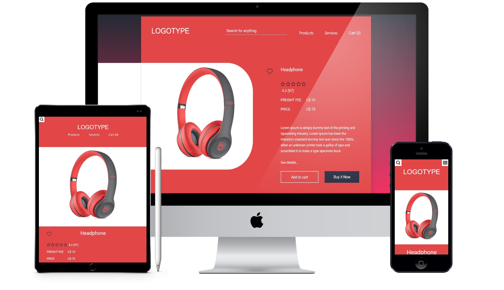

<h1 align="center">
    
</h1>

<p align="center">
  <a href="#-Project">Project</a>&nbsp;&nbsp;&nbsp;|&nbsp;&nbsp;&nbsp;
  <a href="#-Layout">Layoult</a>&nbsp;&nbsp;&nbsp;|&nbsp;&nbsp;&nbsp;
  <a href="#-Technology">Technology</a>&nbsp;&nbsp;&nbsp;|&nbsp;&nbsp;&nbsp;
  <a href="#-Environment">Environment</a>&nbsp;&nbsp;&nbsp;|&nbsp;&nbsp;&nbsp;
  <a href="#%EF%B8%8F-license">License</a>&nbsp;&nbsp;&nbsp;|&nbsp;&nbsp;&nbsp;
  <a href="#-Participants">Participants</a>
</p>
<br>

<p align="center">
  
</p>
<br>

<p align="center">
 
</p>

## 💻 Project

Creating <strong>e-commerce</strong> page to study purposes. 🎓

This page was created using only HTML, CSS and JavaScript.

It is the first practical project of the [@CollabCode's](https://collabcode.training/) full-stack web development course.

<br>

## 🎨 Layout
<p align="center">


<br>

## 🔨 Technology

<p align="center">
  
</p>

<br>

## 📝 Environment

1. Clone the repository: 
```bash 
git@github.com:CaioLemec/ecommerce-page.git
```
2. Open project folder in VSCode:
```bash
 cd ../ecommerce-page
 ```
4. Install live server extension:
```bash
 Ctrl + Shift + X   //   search "live server".
 ```
5. Opem index.html with live server:
```bash
Right click on "index.html"   //   choose the option "Open with live server".
 ```
7. Access the generated address in your browser:
```bash
http://127.0.0.1:port/index.html
```

<br>

## ⚖️ License

<br>

This project is licensed under the MIT [LICENSE](LICENSE.md).

<br>

## 😃 Participants
<br>

<br>
<sub>&nbsp;&nbsp;&nbsp;Caio Lemec</sub>

<br>
<br>

[](caiolemec@gmail.com) [](https://br.linkedin.com/in/caio-lemec/) 


<hr>

<p align="center">⭐&nbsp;&nbsp;&nbsp;   Developed by Caio Lemec  &nbsp;&nbsp;&nbsp;⭐</p>
